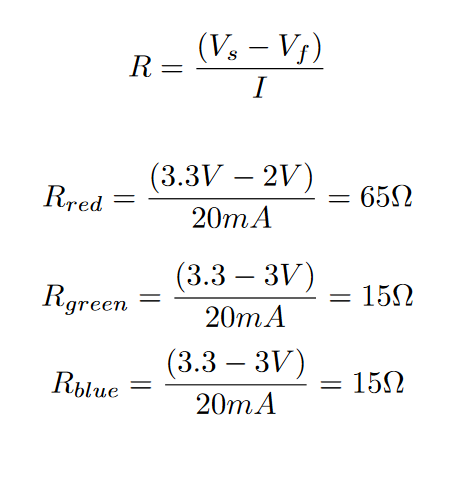
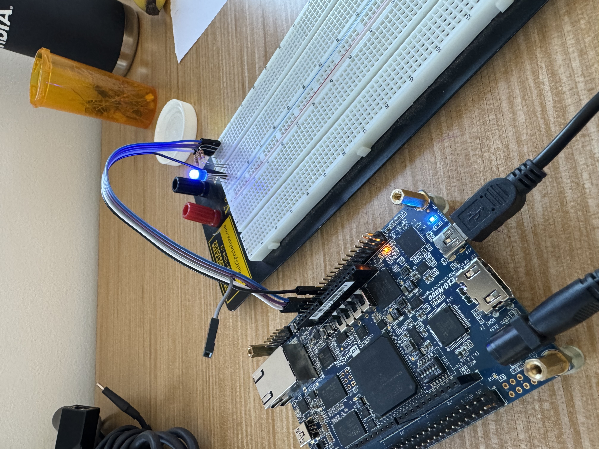
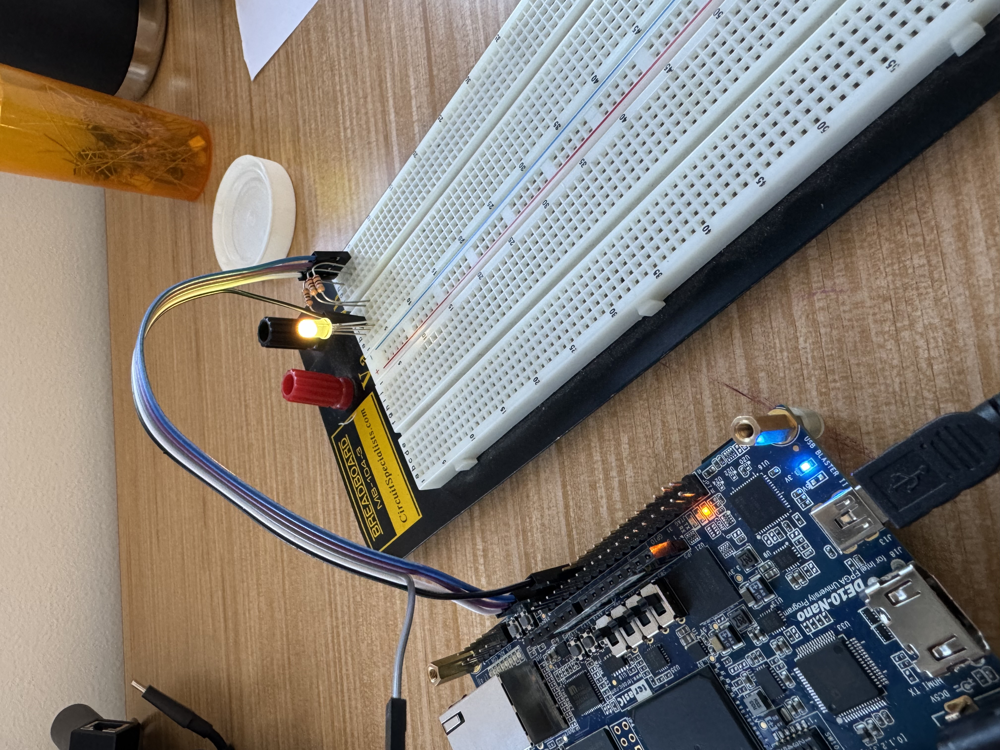

# Homework 10: RGB LED Controller VHDL

## Overview
The objective of this homework was to create an RGB LED controller in VHDL which would implement our PWM controller which we designed in an earlier homework. 
This RGB LED controller would take in a custom fixed point data types in avalon memory mapped registers for period and duty cycle for red, blue, and green. 
For this lab I was assigned base address of `0x001B4B00` for my avalon registers.

## Deliverables

The Resistors for the RGB LED were calculated for a max current of 20mA as shown below.

However 100 ohm resistors were used as they were the only ones I had available.

The three primary colors were shown

A custom color of yellow was chosen

