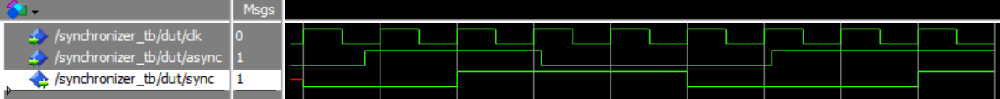

# Homework 3: Synchronizer VHDL

## Overview
Because synchronous design is very important in digital systems, a VHDL synchronizer will be commonly used in this class. The assignment of this homework was to implement this VHDL sychronizer and simulate it.

## Deliverables

