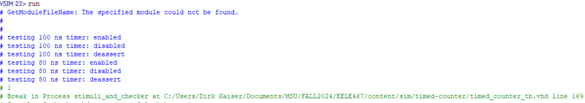
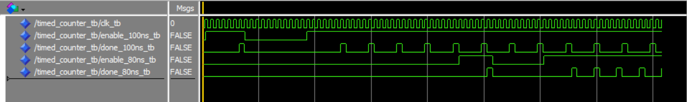

# Homework 4: Timed Counter

## Overview
This assignment was to get more practice with creating test benches in VHDL. In this assignment, a timed counter component was created and then tested. 

## Deliverables

