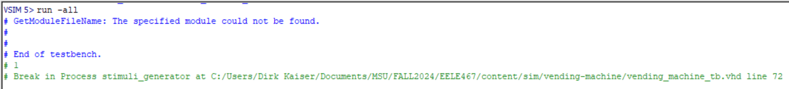
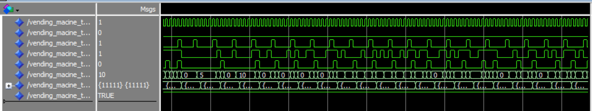

# Homework 5: Vending Machine VHDL

## Overview
This assignment was to practice using state machines. To do so a simple vhdl vending machine was made following the given state machine diagram.

## Deliverables

