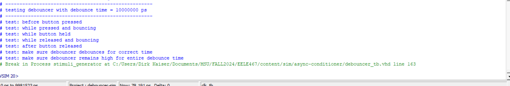
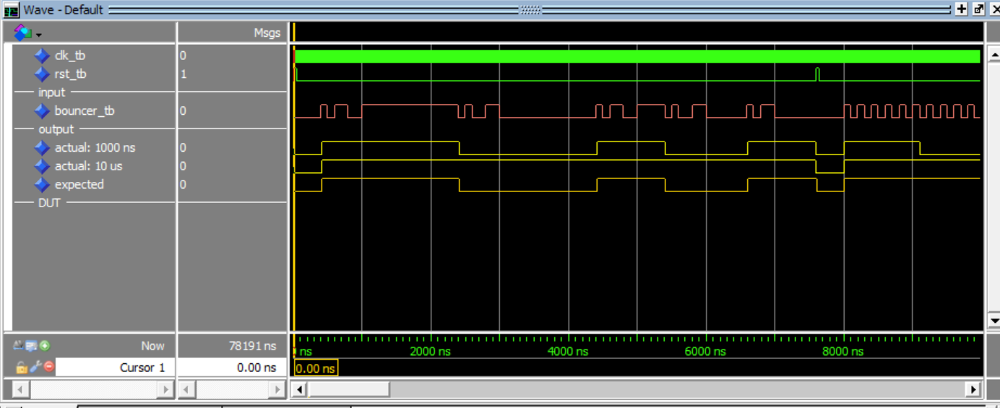
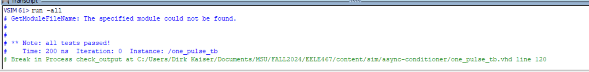
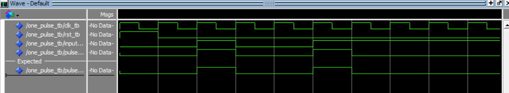
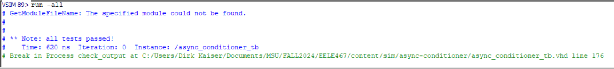
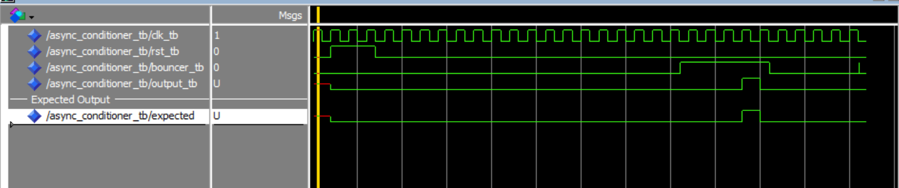

# Homework 6: Async Conditioner

## Overview
When using physical inputs with an FPGA, the signals often need to be conditioned into a usable format. This assignment an asynchronous signal conditioner made up of our synchronizor componenet and two new components, a debouncer and a one pulse generator.

## Deliverables
### Debouncer:

### One Pulse:

### Async Conditioner:

