# Homework 7: Linux CLI Practice
## Overview
The objective of this homework is to familiarize ourselves with the linux comand line and practice using different commands.

## Deliverables
### Problem 1
`wc -w lorem_ipsum.txt`

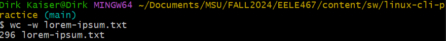
### Problem 2
`wc -m lorem_ipsum.txt`

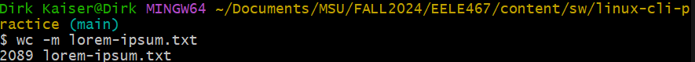
### Problem 3
`wc -l lorem_ipsum.txt`

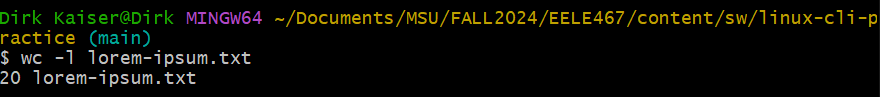
### Problem 4
`sort -h file-sizes.txt`

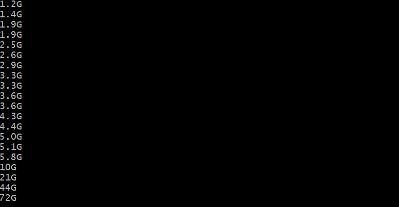
The output of this command was too long to include the whole thing
### Problem 5
`sort -h -r file-sizes.txt`

Again, the output of this command was too long to include the whole thing.
### Problem 6
`vim log.csv` 

To find the column corresponding to ip addresses

`cut -d ',' -f 3 log.csv`

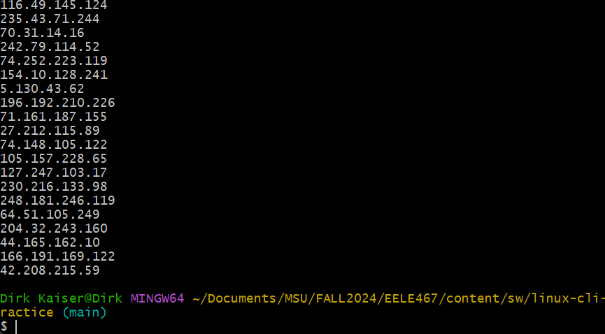
### Problem 7
`cut -d ',' -f 2-3 log.csv`

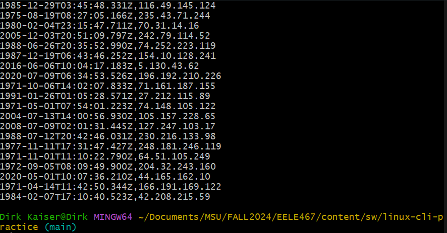
### Problem 8
`cut -d ',' -f 1,4 log.csv`

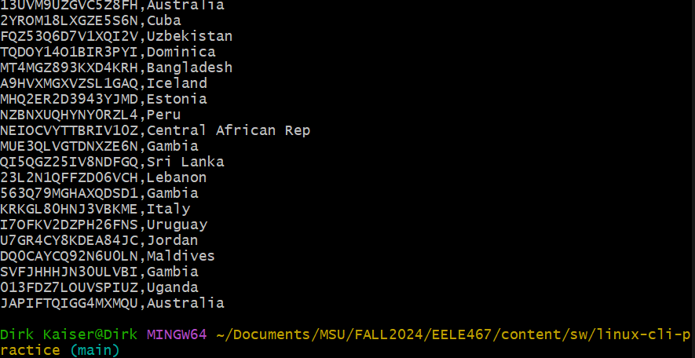
### Problem 9
`heads -n 3 gibberish.txt`

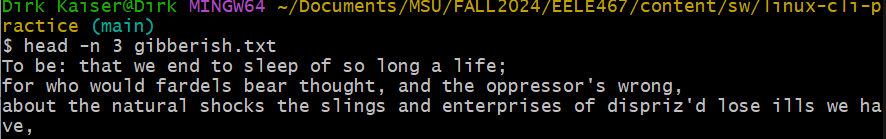
### Problem 10
`tail -n 2 gibberish.txt`

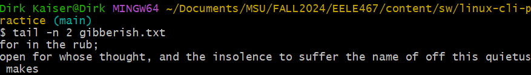
### Problem 11
`tail -n+2 log.csv`

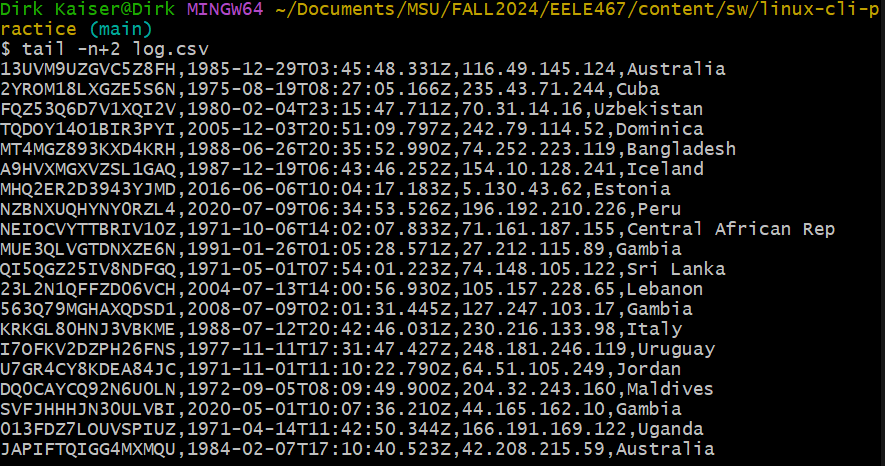
### Problem 12
`grep 'and' gibberish.txt`

### Problem 13
`grep -o -n 'we' gibberish.txt`

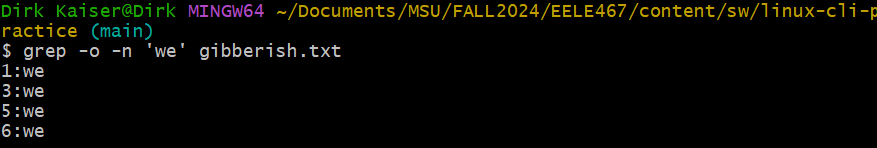
### Problem 14
`grep -o -i -P 'to [\w]+' gibberish.txt`

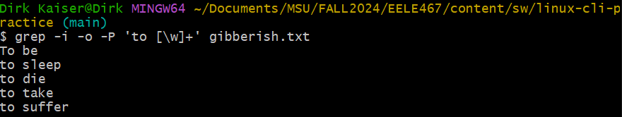
### Problem 15
`grep -i -o -c 'fpgas' fpgas.txt`

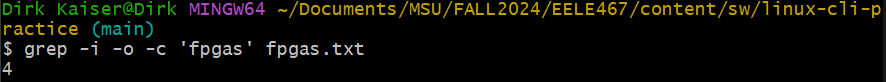
### Problem 16
`grep -i -P 'hot|not|cower|tower|smile|compile' fpgas.txt`

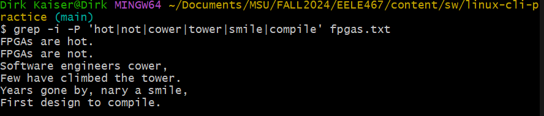
### Problem 17
`grep -c -P '^\s*--' ../../hdl/*/*.vhd`

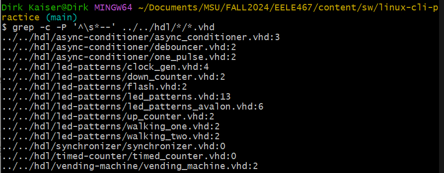
### Problem 18
`ls > ls-output.txt | cat ls_output.txt`

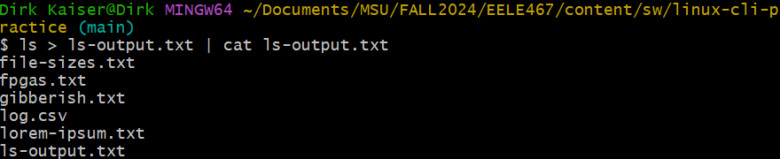
### Problem 19
`sudo dmesg | grep 'CPU topo'`

This didn't output anything because there is no 'CPU topo' in the dmesg. So instead I just did this instead:

`sudo dmesg | grep 'CPU'`

### Problem 20
`find ../../hdl -iname '*.vhd' | wc -l`

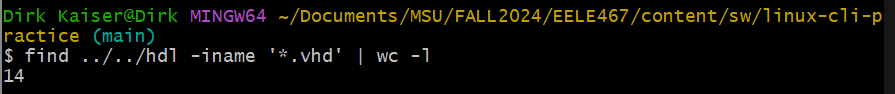
### Problem 21
`grep -r '[--]' ../../hdl/*/*.vhd | wc -l`

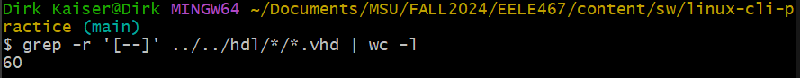
### Problem 22
`grep -n FPGAs -i fpgas.txt | cut -d ':' -f 1`

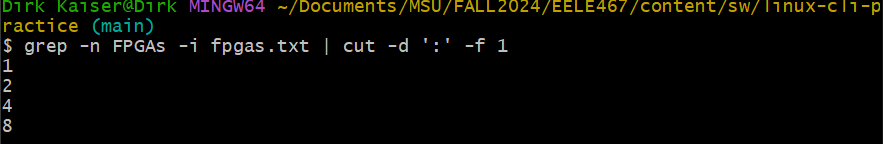
### Problem 23
`du -h * | sort -h`

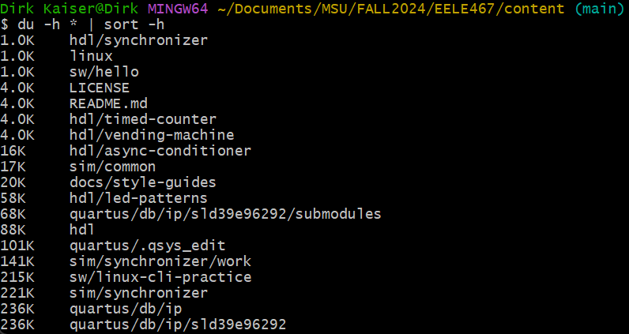
