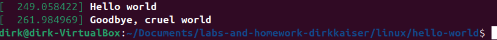
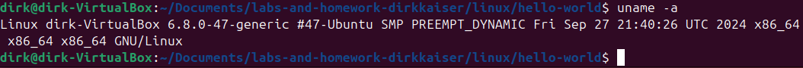
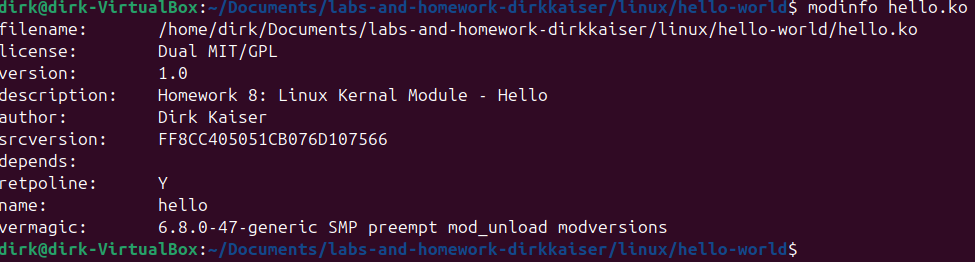
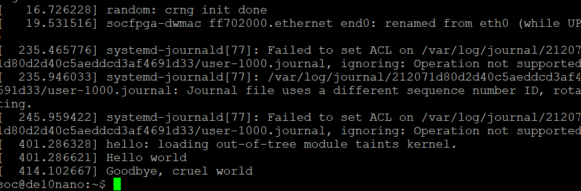
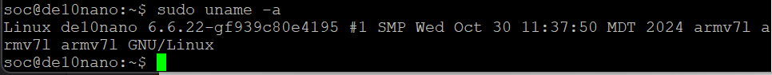
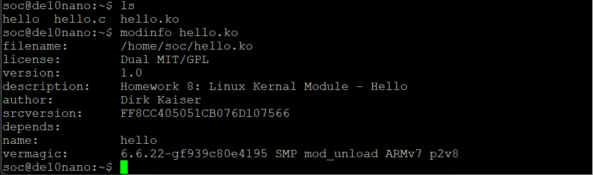

# Homework 8: Linux Kernel Module

## Overview
The objective of this homework was to get familar with linux kernel modules and makefiles. In this homework a linux kernel module was created and then compiled for both our Linux VM and ARM.

## Deliverables
### Linux VM:

### ARM Linux:

