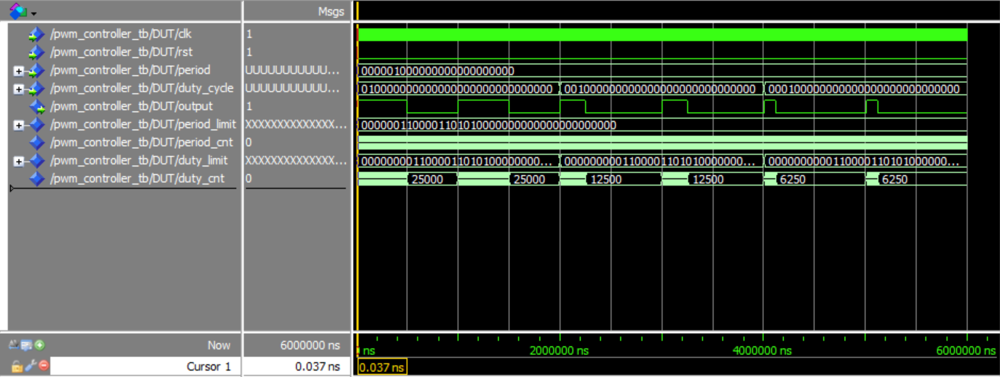
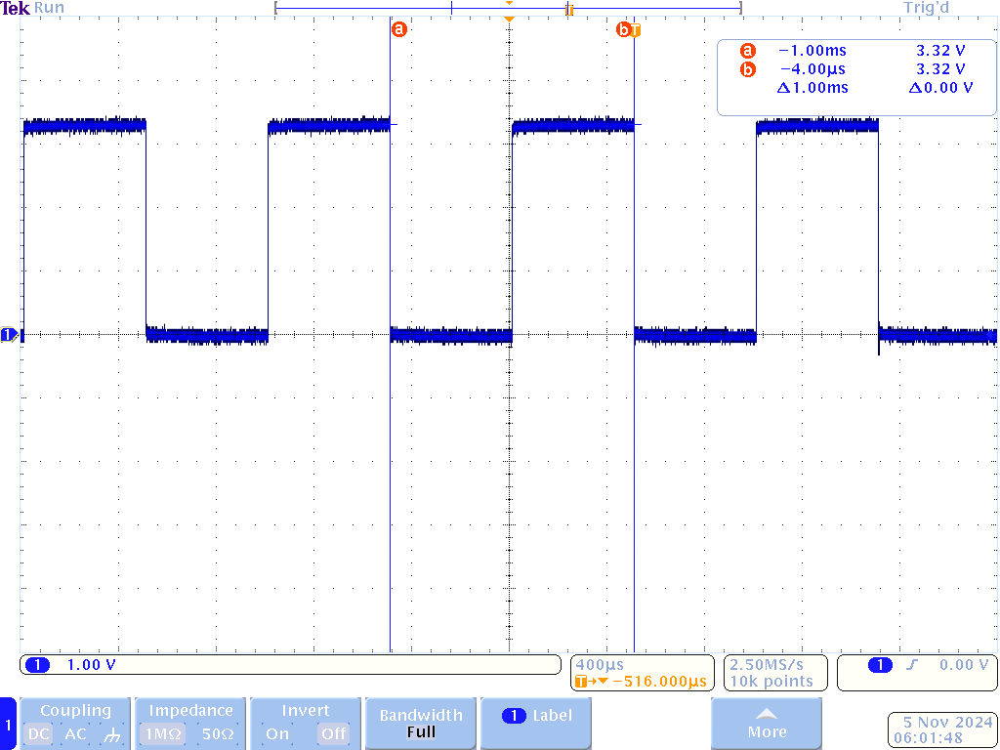
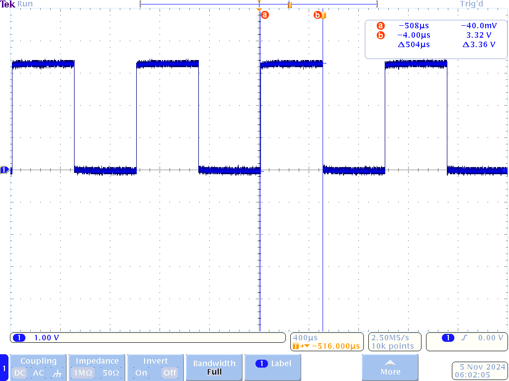

# Homework 9: PWM Controller VHDL

## Overview
The objective of this lab was to create a PWM controller in VHDL which we would then use in later labs. 
This PWM controller would take in a custom fixed point data types for period and duty cycle. 
For this lab I was assigned 24.18 (W.F) period and 30.29 (W.F) duty cycle data types.

## Deliverables
The PWM controller was first simulated in ModelSim

A period of 1 ms and and 50% duty cycle was programmed and flashed onto the fpga. The osciliscope captures show this below.
### Period

### Duty Cycle

