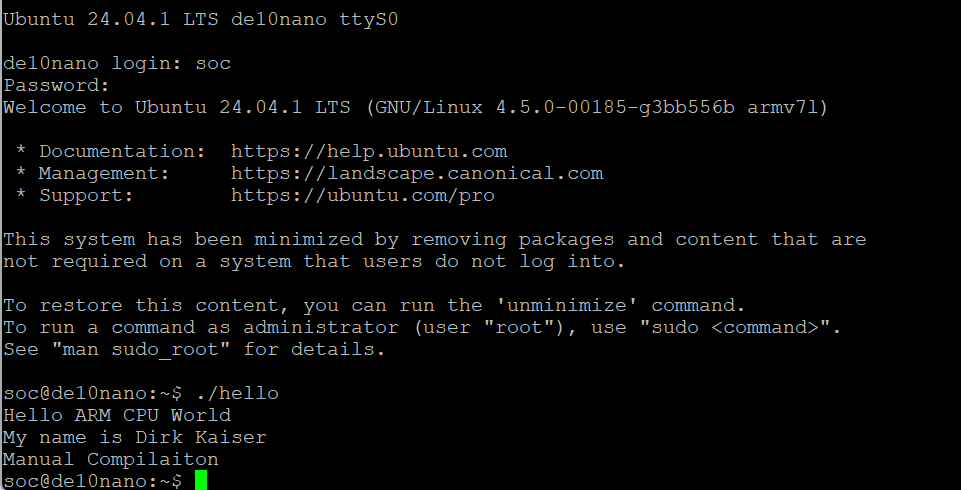

# Lab 3 : Developers Setup
Dirk Kaiser - Montana State University - Fall 2024

## Overview
In this lab we were tasked with setting up the tftp and nsf servers for booting our fpga and then compiling code to the nfs server to run on the ARM CPU.

## Deliverables
