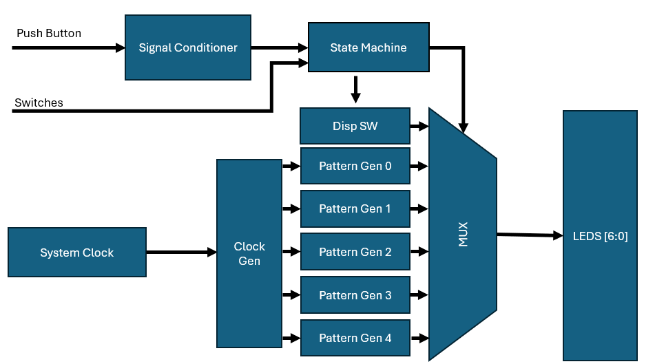
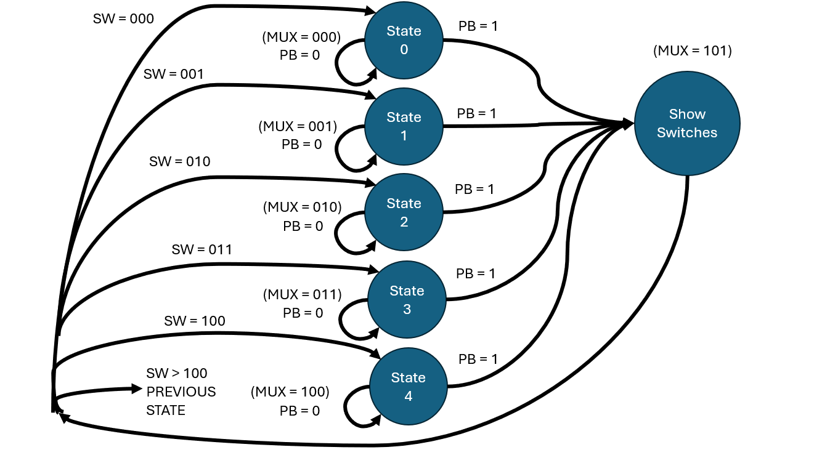
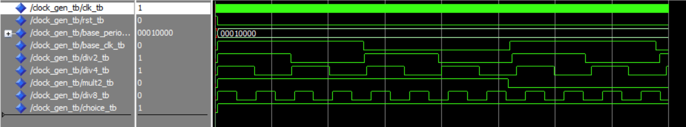

# Lab 4: Creating A LED Pattern Generator

## Project Overview
In this project we were tasked with creating a LED pattern generator in the FPGA fabric. The generator needed to take physical inputs and output different patterns on the 8 integrated LEDs. The fuctional requirements of this project were as follows: 
- have the led output have the option to be controlled by the ARM PS side of the FPGA
- have a user defined base period for the led patterns
- Switch between patterns with slide switches and push buttons
- have the eighth led flash at the base period
- Pattern 0: rotate left at half base period
- Pattern 1: rotate two leds right at a quarter base period
- Pattern 2: 7 bit counter at double the base period
- Pattern 3: 7 bit down counter at an eighth base period
- User Defined Pattern with own pattern transition rate
- When switching between patterns, display switch value
## System Architecture

The above figure shows the block diagram used to create the system arcitecture of the design. In this block the system clock is inputted into a clock gen component which creates the 5 different clocks for the patterns based off the base period. A signal conditioner component is used to synchronize and turn a pushbutton press into a single pulse. Finally, a state machine will choose which what is shown on the output LEDs by contolling a multiplexer.

The state machine mentioned above follows the state diagram as shown. When the push button is not pressed the states do not change. once the push button is pressed, the show swictches state is transitioned to and then based on the switches the next state is chosen.

## Implementation Details
As part of the lab, a custom LED pattern was created. Because I am lazy and uninspired my custom LED pattern was to flash all of the LEDs at 8 times longer than the based period. 

Furthermore, while completing the labs, multiple test benches were created to test functionallity of each component. The image below shows the coolest test bench.

