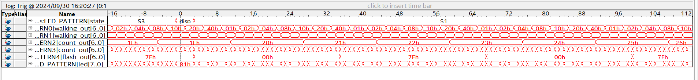
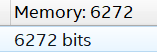

# Lab 5: Signal Tap

## Lab Overview
The purpose of this lab was to get familar with Quartus' Signal Tap feature. Using the same design from Lab4, Signal Tap was used to inspect the states.

## Signal Tap Waveform

The image shows the transistion from state three (pattern3) to state 1 (pattern1).
## Memory Usage

This image shows the memory usage stat from signla tap.
