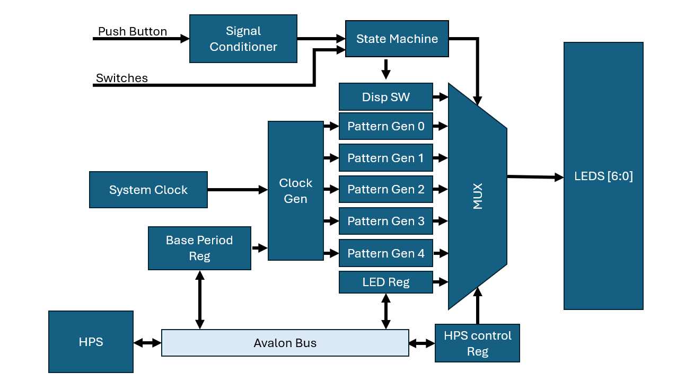
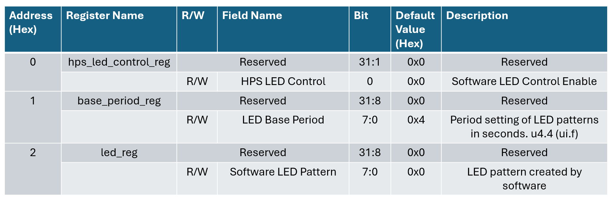
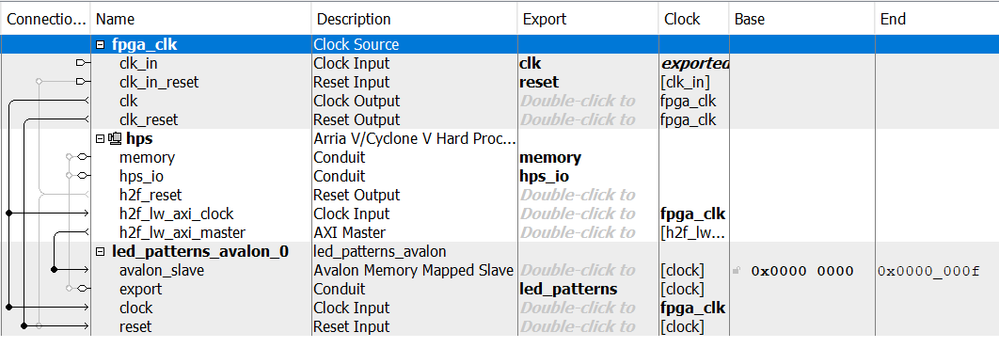

# Lab 6: Creating A Custom Component in Platform Designer

## Project Overview
In this project we were tasked with creating a custom component in Platform Designer that would allow for software control of the LED Pattern component from lab-4 using an Avalon bridge to connect the fabric to the HPS on our DE-10 Nano FPGA.

## System Architecture

The above figure shows the block diagram used to create the system arcitecture of the design. This system architcture is the same as lab-4 but with a few noteable exceptions. Now, an Avalon Bus connects the HPS to three new registers. The base period register sets the period for the clock generator, the LED register allows for the HPS to have it's own pattern to be outputted, and the HPS control register allows for enabling and disablling software control of the LEDs.

## Register Map

The register map above shows the previously described three new registers and which address they coorispond with. It also shows the bitfield for each register as well as other useful information.

## Platform Designer

After loading the soc_system.qsys file we were able to create and add the led_patterns_avalon component to the system. Then, the HPS h2f_lw_axi_master could be connected to the avalon_slave (however, I don't really know why one is axi and the other is avalon... I guess they're compatable) as well as the hps clock and reset.

The base address of my avalon memory mapped component in Platform Designer is 0x0000_0000 and ends on 0x0000_000f as shown in the image above. 